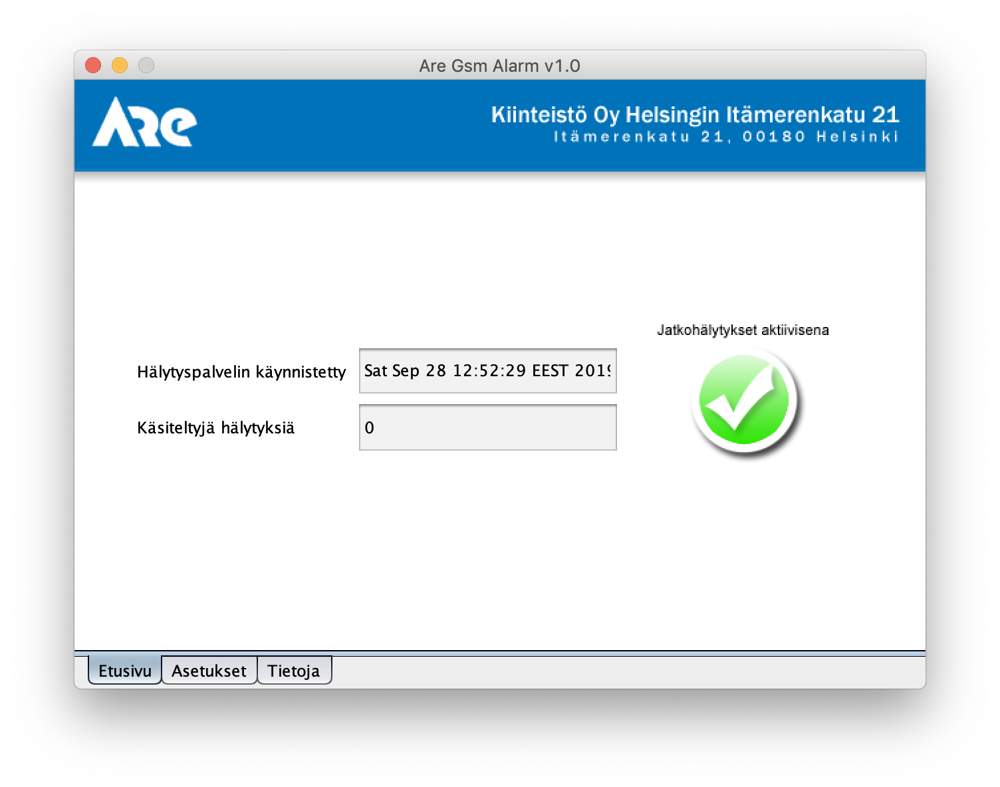
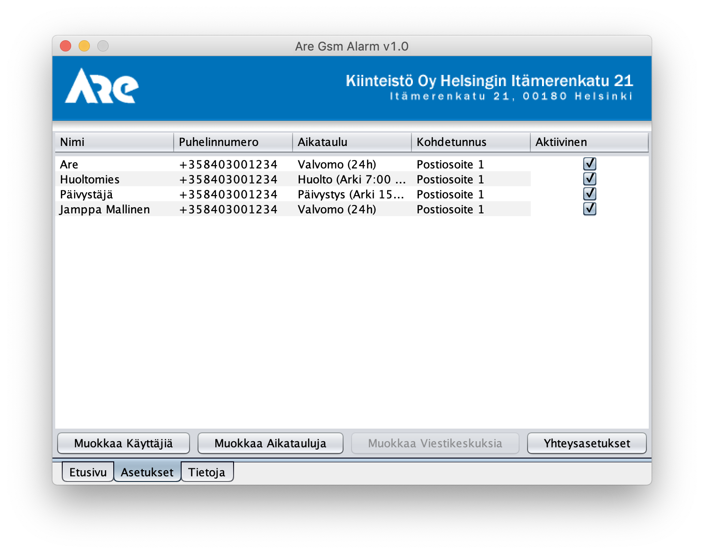
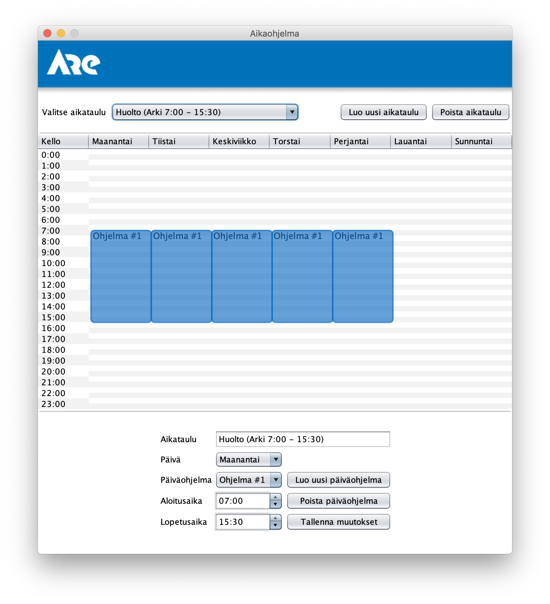
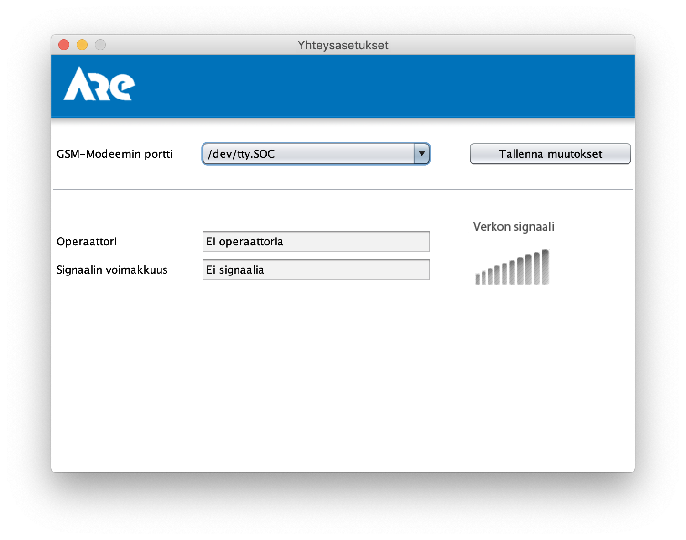
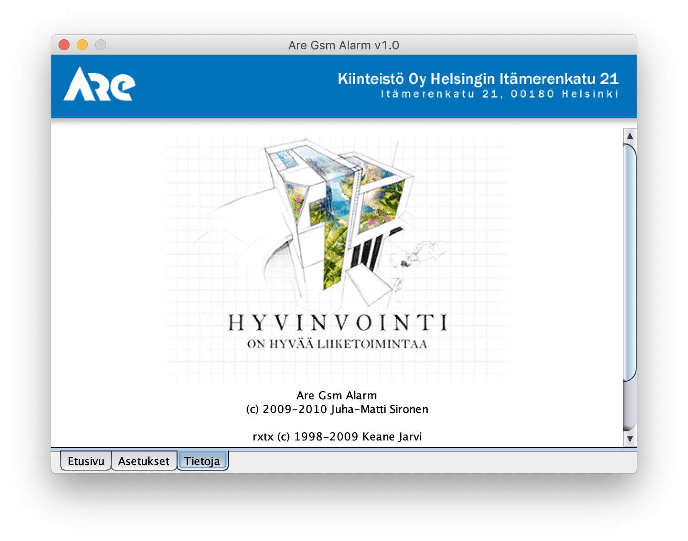

# AreGsmAlarm
This repository is just for the storage purposes. This is an old Java app for managing alarms from Niagara (https://www.tridium.com/) systems. 

Serial communication was originally dependant on http://rxtx.qbang.org/wiki/index.php/Main_Page but has now updated to
 https://github.com/NeuronRobotics/nrjavaserial and using Maven for builds.

This app was used with Siemens MC55/TC65 GSM-modem that was connected to the servers serial-port.

#### Build

```
mvn package
```

#### Run

```
java -jar AreGsmAlarm.jar
``` 

#### Additional Components
- AlarmTestClient.java - just as the name implies, test client for sending alarms in different categories
- AreTimeServer.java - timeserver for the automation devices
- Niagara/AreAlarmServlet.java - Servlet to be installed on the Niagara server
 
### Screenshots


 






